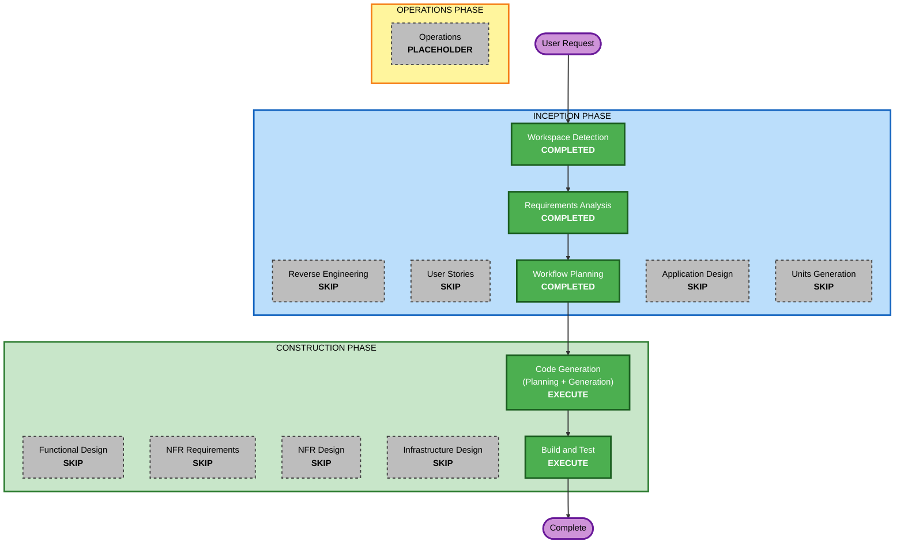

# Execution Plan - Session 5: jake-laptop-nixos Host Import

## Detailed Analysis Summary

### Transformation Scope (Brownfield)
- **Transformation Type**: Single component addition (new host) + 2 new modules
- **Primary Changes**: New host definition, battery module (NixOS + HM), shared package refactor
- **Related Components**: core/packages.nix (new shared host config), erebor/default.nix (package cleanup), jake.nix (user@host entry)

### Change Impact Assessment
- **User-facing changes**: No - declarative config, no runtime changes to existing hosts
- **Structural changes**: No - follows established host/module patterns from sessions 1-4
- **Data model changes**: No
- **API changes**: No
- **NFR impact**: No

### Component Relationships
```
modules/hosts/jake-laptop-nixos/default.nix
  ├── imports NixOS: hyprland, firefox, steam, battery (new)
  ├── imports HM: hyprland, waybar, dunst, hypridle, hyprlock, hyprpaper,
  │               wlogout, wofi, terminal, firefox, aiAgents, devops,
  │               spotifyPlayer, cava, mpv, battery (new - HM side)
  └── depends on: modules/jake.nix (jake@jake-laptop-nixos)

modules/system/battery.nix (NEW)
  ├── flake.modules.nixos.battery (TLP, thermald, powertop)
  └── flake.modules.homeManager.battery (battery-warning-daemon systemd service)

modules/core/packages.nix (NEW)
  └── flake.modules.homeManager.core - shared linux host packages

modules/jake.nix (MODIFY)
  └── add: jake@jake-laptop-nixos empty module

modules/hosts/erebor/default.nix (MODIFY)
  └── remove: packages now shared via core/packages.nix (wl-clipboard, sshfs, bc, unzip, ruby)
```

### Risk Assessment
- **Risk Level**: Low - follows established patterns, isolated new host
- **Rollback Complexity**: Easy - new files can be deleted, jake.nix edits reverted
- **Testing Complexity**: Simple - nix flake check validates all configurations

## Workflow Visualization



### Text Alternative
```
Phase 1: INCEPTION
- Stage 1: Workspace Detection (COMPLETED)
- Stage 2: Reverse Engineering (SKIP - patterns established in sessions 1-4)
- Stage 3: Requirements Analysis (COMPLETED)
- Stage 4: User Stories (SKIP - infrastructure config, no user personas)
- Stage 5: Workflow Planning (COMPLETED)
- Stage 6: Application Design (SKIP - no new components/services)
- Stage 7: Units Generation (SKIP - single unit of work)

Phase 2: CONSTRUCTION
- Stage 8: Functional Design (SKIP - no complex business logic)
- Stage 9: NFR Requirements (SKIP - no NFR concerns)
- Stage 10: NFR Design (SKIP - no NFR concerns)
- Stage 11: Infrastructure Design (SKIP - no infrastructure changes)
- Stage 12: Code Generation (EXECUTE - planning + generation)
- Stage 13: Build and Test (EXECUTE - nix flake check validation)

Phase 3: OPERATIONS
- Stage 14: Operations (PLACEHOLDER)
```

## Phases to Execute

### INCEPTION PHASE
- [x] Workspace Detection (COMPLETED)
- [ ] Reverse Engineering - SKIP
  - **Rationale**: Patterns fully established across 4 prior sessions
- [x] Requirements Analysis (COMPLETED)
- [ ] User Stories - SKIP
  - **Rationale**: Infrastructure/config import, no user personas or workflows
- [x] Workflow Planning (COMPLETED)
- [ ] Application Design - SKIP
  - **Rationale**: No new component design needed; reusing established module patterns
- [ ] Units Generation - SKIP
  - **Rationale**: Single unit of work; all files are closely related

### CONSTRUCTION PHASE
- [ ] Functional Design - SKIP
  - **Rationale**: No complex business logic; battery module is straightforward config
- [ ] NFR Requirements - SKIP
  - **Rationale**: No performance, security, or scalability concerns
- [ ] NFR Design - SKIP
  - **Rationale**: NFR Requirements skipped
- [ ] Infrastructure Design - SKIP
  - **Rationale**: No infrastructure changes
- [ ] Code Generation - EXECUTE (ALWAYS)
  - **Rationale**: 5 new files + 2 modified files to implement (was 5+2 before, now 5+2 with different file set)
- [ ] Build and Test - EXECUTE (ALWAYS)
  - **Rationale**: nix flake check to validate all configurations

### OPERATIONS PHASE
- [ ] Operations - PLACEHOLDER
  - **Rationale**: Future deployment and monitoring workflows

## File Change Summary

| # | Action | File | Description |
|---|--------|------|-------------|
| 1 | CREATE | `modules/system/battery.nix` | Battery module: NixOS (TLP, thermald, powertop) + HM (warning daemon systemd service) |
| 2 | CREATE | `modules/core/packages.nix` | Shared linux host packages (wl-clipboard, sshfs, bc, unzip, ruby, blender, prismlauncher, mumble, discord, rpi-imager, spotify) |
| 3 | CREATE | `modules/hosts/jake-laptop-nixos/default.nix` | Host definition + NixOS/HM module imports |
| 4 | CREATE | `modules/hosts/jake-laptop-nixos/hardware-configuration.nix` | AMD laptop hardware config (from source) |
| 5 | CREATE | `modules/hosts/jake-laptop-nixos/users.nix` | jake user definition |
| 6 | MODIFY | `modules/jake.nix` | Add jake@jake-laptop-nixos empty module |
| 7 | MODIFY | `modules/hosts/erebor/default.nix` | Remove packages now shared via core/packages.nix |

## Success Criteria
- **Primary Goal**: jake-laptop-nixos host builds successfully via nix flake check
- **Key Deliverables**: Host config, battery module (NixOS + HM daemon), shared core packages, erebor cleanup
- **Quality Gates**: nix flake check passes for both jake-laptop-nixos and erebor

## Extension Compliance
| Extension | Enabled | Status |
|---|---|---|
| Security Baseline | No | N/A - disabled |
| Property-Based Testing | No | N/A - disabled |
